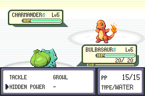
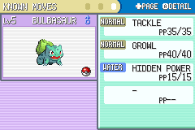

### Unhidden Power

This routine makes the game calculate and display the actual type of Hidden Power in battle and in status screens. If, for example, a Pokémon's Hidden Power type is Water, it will display as a Water-type move, just like Surf or any other Water-type move.

#### How do I insert this?

First, open `unhidden-power.asm` in a text editor to customize it.

Tweak the definition of `free_space` to be where you want the code inserted. You'll need `184` bytes starting from a word aligned offset (read: an offset ending in `0`, `4`, `8`, or `C`).

This is optional and entirely aesthetic, but you can choose to have Hidden Power updated to be a `???`-type TM instead of a `Normal`-type TM by changing `change_hp_static_type` from `false` to `true`. There's no associated Pokémon, so the TM Case will retain whatever Hidden Power's "static type" happens to be.

You'll need to have [armips](https://github.com/Kingcom/armips).

Place your ROM in this folder and name it `rom.gba`.

Once you're ready, assemble with `armips unhidden-power.asm`; it'll generate `test.gba`, which is your output (`rom.gba` will not be modified).